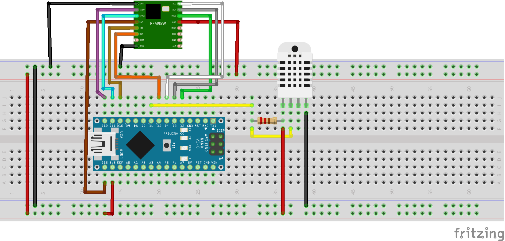
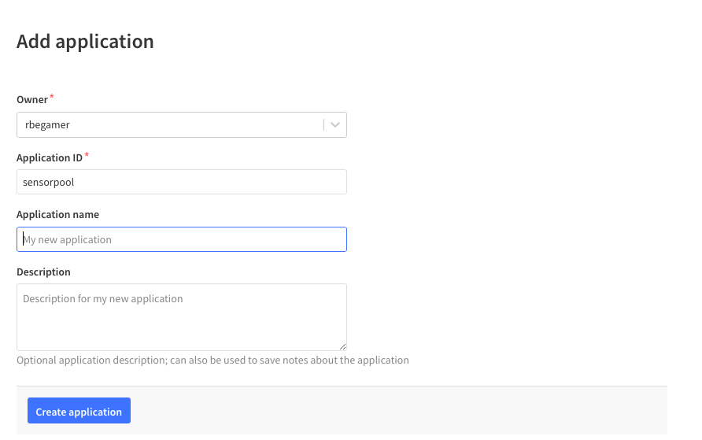
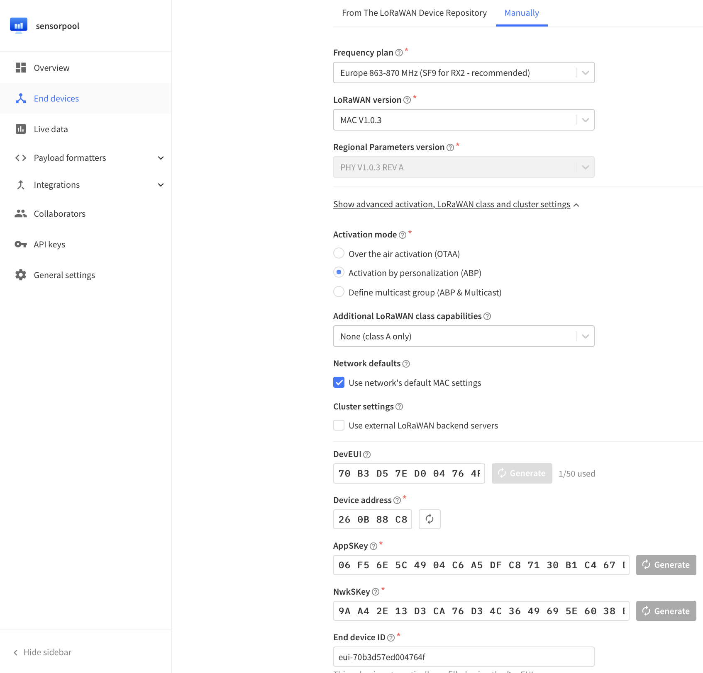

# MSFHAC_Lora_DHT22_Node

Einfacher Temperatur und rel. Luftfeuchtigkeits Lora-Wan Sensor basierend auf dem DHT22 und RFM95/RFM96 im Zusammenspiel mit einem Arduino Nano.

Die besonderheit an dieser Variante, ist die Verwendung des Lora Funkstandards im Zusammenspiel mit dem Lora-Wan Protokoll. 
Dies ermöglicht den Empfang der Sensordaten über viele Kilometer hinweg.
Um eine Übertragung der Sensordaten in das Internet zu ermöglichen, wir ein dezentrales Netzwerk aus Empfangsstationen (Gateways) verwendet.
Diese werden in der Regel von Privatpersonen oder Firmen bereitgestellt.

Ein weiterer Vorteil dieser Architektur ist, dass nicht jeder eine Gateway benötigt, welcher Daten mit seinem Lora-Wan Device senden möchte.
Natürlich nur solange, wie ein Gateway in Reichweite ist. Dafür gibt es fertige Karten, welche die Abdeckung an einem Ort darstellen.

Diese Gateways können ihre Daten an einen Server im Internet senden, welcher diese dann als z.B. REST-Api bereitstellt.
In diesem Beispiel verwenden wir das [The Things Network (TTN)](https://www.thethingsnetwork.org).


## BEISPIELHAFTER AUFBAU DES SENSORS

### FINALER SENSOR


### STECKBRETT MIT ADAPTERPLATINE


## SETUP

### HARDWARE SETUP

#### KOMPONENTEN

* Arduino Nano
* DHT22
* RFM95, RFM95W oder RFM96
* Steckbrett
* Jumperwires


#### OPTINALE KOMPONENTEN

* 3D-Druck Gehäuse - Alle Dateien befinden sich in `src/src_stl`
* `Abzweigdose IP54 aufputz 150x110x70mm`

* `Adafruit Universal USB DC Solar Lithium Ion Polymer Lipo Charger` - Solar Support
* `10W Solarpanel 12V ` - Solar Support
* `iPo Akku Lithium-Ion Polymer Batterie 3,7V 2000mAh` - Solar Support

#### TOOLS

* Lötkolben
* Lötzinn

#### SCHALTUNG

Der Aufbau der Schaltung ist relative einfach. Jedoch kann das `RFM95` Modul nicht direkt auf das Steckbrett gesteckt werden, da dies ein anderes Rastermaß von 2.0mm verwendet und das Steckbrett 2.54mm. Somit gibt es hier zwei Möglichkeiten:

* Jumperwires direkt an das `RFM95` Modul anlöten.
* Eine Adapter-Platine verwenden - `src/src_rfmbreadboardadapter` 


Der Arduino Nano und das RFM95 Module kommunizieren über den SPI Bus miteinander. Zusaetzlich verwendet das RFM95 Modul vier weitere GPIO Pins des Arduino, um mit diesen weitere Statusinformationen auszutauschen. Hierzu gehören unter anderem ein `RESET` Signal und ein Empfangs-Event-Signal.

Der SPI Bus besteht in dieser Konfiguration aus den folgenden Signalen:

* `SCK` - Clock
* `MOSI` - Master Out Slave In 
* `MISO` - Master In Slave Out
* `CS` - Chip Select

Somit wird das RFM95 Modul folgendermaßen mit dem Arduino Nano verbunden:

| Arduino Nano  	| RFM95      	|
|---------------	|------------	|
| GND           	| GND        	|
| 3V3           	| 3.3V / VCC 	|
| D13           	| SCK        	|
| D12           	| MISO       	|
| D11           	| MOSI       	|
| D10           	| NSS        	|
| D5            	| RST        	|
| D2            	| DIO0       	|
| D3            	| DIO1       	|
| D4            	| DIO4       	|


Nachdem das RFM Modul verbunden wurde, kann anschliessend der DHT22 Sensor verbunden werden.
Dieser stellt jedoch nur ein Beipiel dar und es können später auch andere Sensoren verwendet werden.
Er verwendet zur Kommunikation ein Bus-Protokoll welches über einen GPIO die Sensordaten an den Arduino schickt.
Somit wird nur ein Pin am Arduino belegt.
Der Bus wir in einer Pull-Up Konfiguration betrieben, somit muss ein zusätzlicher 10k Widerstand gegen 3.3V und dem Daten-Pin angeschlossen werden.
Somit wird der 10K Widerstand zwischen DHT Pin 1 und DHT Pin 2 eingebaut.

| Arduino Nano 	| DHT22        	|
|--------------	|--------------	|
| GND          	| Pin 4 (GND)  	|
| 3V3          	| Pin 1 (VCC)  	|
| D6           	| Pin 2 (Data) 	|

Die folgende Grafik zeigt einen exemplarischen Aufbau der Schaltung.




### The Things Network

Um unseren Sensor im späteren Verlauf programmieren können, muss dieser zuerst getauft werden. Jedes Lora-Wan Gerät bekommt eine feste ID von dem zu verwendenen Netzwerk. In diesem Fall ist es das TTN und dort muss der Sensor registriert werden. Nach dieser bekommen wir zwei Schlüssel, welche für eine verschlüsselte Verbindung zwischen benötigt werden. Diese werden dann in das spätere Arduino Programm eingefügt.


### Application Registrieren

Nach der Registrierung eines Accounts, bietet das TTN in der TTN Console zwei möglichkeiten:

* Application
* Gateway

Das TTN gruppiert mehrere Lora-Devices in Applications, daher muss zuerst eine neue Application mit einem beliebigen Namen erstellt werden.





Nach der Erstellung kann über den **+ Add Enddevice** Button ein Lora-Wan-Device hinzugefügt werden.
Hier müssen einige Informationen angegeben werden. Da dies ein selbstbau Sensor ist, gibt es für diesen noch kein fertiges Template, welches verwendet werden kann.

Hier muss in den Reiter "Manual" gewechselt werden und die folgenden Daten eingegeben werden:

| Eintrag 	| Wert 	|
|-------------------------	|-------------------------	|
| Frequency plan	| Europe 863-870MHz SF9 for RX2 - recommended |
| LoRaWAN Version      	| MAC V1.0.3 |
| Activation mode      	| Activation by personalisation (ABP) |

Anschliessend auf die drei "Generate" Button klicken und final "Register Device"





### SOFTWARE SETUP ARDUINO

Der Arduino Nano wird mit der Aruino IDE programmiert. Für die verwendeten Komponenten müssen jedoch noch bereits fertige Bibliotheken installiert werden, welche die einfache Ansteuerung des RFM95 Moduls, sowie des DHT22 ermöglichen.

Auch das LoraWan-Protokoll welches hier verwendet wird, gibt es bereits in einer entsprechenden Bibliothek.

Dies kann entwieder durch den Arduino-Library Manager geschehen oder durch das kopieren der entsprechenden Ordner aus dem `src_arduino/required_libraries` Verzeichnis in den `Dokumente/Arduino/library` Ordner des PCs.

Die folgenden Bibliotheken müssen somit installiert werden:

| Arduino Bibliothek Name 	|
|-------------------------	|
| Adafruit_Unified_Sensor 	|
| DHT_sensor_library      	|
| IBM_LMIC_framework      	|

Alle anderen Softwarekomponenten bringt die Arduino IDE schon mit der Installation mit, so z.B. auch für die SPI Kommunikation.

Nach der Installation der Bibliotheken, kann der Quellcode für den Sensor geöffnet werden.

Dieser befindet sich im Ordner `src_arduino/lora_dht22_apb/lora_dht22_apb.ino`.
Hier wurden schon die notwendigen Einstellungen für die oben genannten Pinbelegungen gesetzt.


Hier sind auch bereits die Einstellungen für die Lora Kommunikation gesetzt. Jeder Sensor besitzt seine eigene feste ID, mit der er sich im LoraWan-Netzwerk identifizieren kann. Diese muss zuerst im folgenden Abschnitt erstellt werden, bevor der Code auf den Arduino aufgespielt werden kann.


### ChirpStack

#### Device-Profile

Create a new Device Profile and use this for each sensor of this type later on.

##### GENERAL

* `Device-profile name` => `abp_dht22_sensor_node_profile`
* `LoRaWAN MAC version` => `1.0.3` 
* `LoRaWAN Regional Parameters revision *` => `A`
* `ADR algorithm` => `Default ADR algorithm`
* `Max EIRP *` => `0` 
* `Uplink interval (seconds)` => `5` 


##### CODEC: Javascript Decode Function

```js
// Decode decodes an array of bytes into an object.
//  - fPort contains the LoRaWAN fPort number
//  - bytes is an array of bytes, e.g. [225, 230, 255, 0]
//  - variables contains the device variables e.g. {"calibration": "3.5"} (both the key / value are of type string)
// The function must return an object, e.g. {"temperature": 22.5}
function Decode(fPort, bytes) {
  var result = "";
  for (var i = 0; i < bytes.length; i++) {
    result += (String.fromCharCode(bytes[i]));
  }
  
  var sp = String(result).split(';');
  return {temperature: parseFloat(sp[0]), humidity: parseFloat(sp[1]), battery: parseFloat(sp[2]),charging: parseFloat(sp[3])}
    
}
```

#### Application
