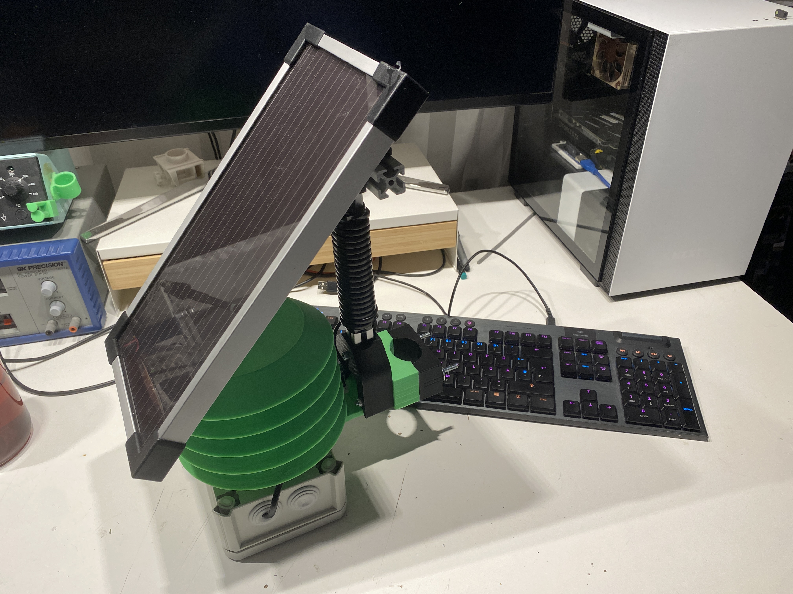

# SimpleLORAWeatherstation

Simple temperature and rel. humidity Lora-Wan sensor based on the DHT22 and RFM95/RFM96 in interaction with an Arduino Nano.

The special feature of this version is the use of the Lora radio standard in combination with the Lora-Wan protocol. 
This allows the reception of sensor data over many kilometers.
To enable the transmission of the sensor data to the Internet, a decentralized network of receiving stations (gateways) is used.
These are usually provided by private individuals or companies.

Another advantage of this architecture is that not everyone needs a gateway who wants to send data with his Lora-Wan device.
Of course, only as long as a gateway is in range. For this purpose, there are ready-made maps that show the coverage at a location.

These gateways can send their data to a server on the Internet, which then provides them as e.g. REST api.
In this case we use the TTN provider [The Things Network (TTN)](https://www.thethingsnetwork.org).


## EXAMPLE SENSOR

### FINAL SENSOR


### WITH MOUNTED SOLAR PANEL




### PROTOTYPE


## SETUP

### HARDWARE SETUP

#### COMPONENTS

* Arduino Nano
* DHT22
* RFM95, RFM95W, RFM96
* Steckbrett
* Jumperwires


* 3D printed parts - `src/src_stl`
* IP54 case 150x110x70mm

* `Adafruit Universal USB DC Solar Lithium Ion Polymer Lipo Charger` - Solar Support
* `10W Solarpanel 12V ` - Solar Support
* `iPo Akku Lithium-Ion Polymer Batterie 3,7V 2000mAh` - Solar Support

#### TOOLS

* soldering iron

#### SCHEMATIC

The construction of the circuit is relatively simple. However, the `RFM95` module cannot be plugged directly onto the breadboard, because this uses a different grid size of 2.0mm and the breadboard 2.54mm. So solder jumperwires directly or use a custom PCB - `src/src_rfmbreadboardadapter`.

The Arduino Nano and the RFM95 module communicate with each other via the SPI bus. In addition, the RFM95 module uses four other GPIO pins of the Arduino to exchange further status information with them. This includes a `RESET` signal and a receive event signal.

The SPI bus consists of the following signals in this configuration:

* `SCK` - Clock
* `MOSI` - Master Out Slave In 
* `MISO` - Master In Slave Out
* `CS` - Chip Select
* 
This way the RFM95 module is connected to the Arduino Nano as follows:

| Arduino Nano  	| RFM95      	|
|---------------	|------------	|
| GND           	| GND        	|
| 3V3           	| 3.3V / VCC 	|
| D13           	| SCK        	|
| D12           	| MISO       	|
| D11           	| MOSI       	|
| D10           	| NSS        	|
| D5            	| RST        	|
| D2            	| DIO0       	|
| D3            	| DIO1       	|
| D4            	| DIO4       	|


After the RFM module has been connected, the DHT22 sensor can be connected.
However, this is only an example and other sensors can be used later.
It uses a bus protocol for communication which sends the sensor data to the Arduino via a GPIO.
So only one pin is used at the Arduino.
The bus is operated in a pull-up configuration, so an additional 10k resistor must be connected against 3.3V and the data pin.
Thus the 10K resistor is installed between DHT pin 1 and DHT pin 2.

| Arduino Nano 	| DHT22        	|
|--------------	|--------------	|
| GND          	| Pin 4 (GND)  	|
| 3V3          	| Pin 1 (VCC)  	|
| D6           	| Pin 2 (Data) 	|

The following graphic shows an exemplary circuit design.


### The Things Network

In order to be able to program our sensor later on, it must first be christened. Each Lora-Wan device gets a fixed ID from the network to be used. In this case it is the TTN and there the sensor has to be registered. After this we get two keys, which are needed for an encrypted connection between. These are then inserted into the later Arduino program.


### Application registration

After registering an account, the TTN offers two options in the TTN Console:

* Application
* Gateway

The TTN groups multiple Lora devices into Applications, so a new Application with any name must be created first.


After creation, a Lora Wan device can be added via the **+ Add Enddevice** button.
Some information must be specified here. Since this is a self-built sensor, there is no ready template for it that can be used.

Here you must switch to the "Manually" tab and enter the following data:

| Key 	| Value 	|
|-------------------------	|-------------------------	                  |
| Frequency plan	          | Europe 863-870MHz SF9 for RX2 - recommended |
| LoRaWAN Version      	    | MAC V1.0.3                                  |
| Activation mode      	    | Activation by personalisation (ABP)         |

Then click on the three "Generate" buttons and finally "Register Device".
This completes the registration of the sensor.


On the overview, there is now some information. Here, three details about the parameterization are important.
These can be displayed in different formats. Click on the eye to display the key and the "<>" button to change the display.
The required information is listed in the following table.

| Information               | Darstellung              | Beispiel                 |
|-------------------------	|------------------------- |------------------------- |
| Device Adress	            |   HEX, MSB ohne 0x       | 260BA509                 |
| NwkSKey                   |   HEX, MSB               | 0xE4, 0x14, 0xC5, 0x65   |
| AppSKeys                  |   HEX, MSB               | 0x0D, 0x79, 0xB8, 0x87.  |


The last step is only important here during development.
The network and the sensor remember how many packets they have already exchanged.
If the sensor is reprogrammed, this counter is not stored in the EEProm, they differ and the network no longer accepts packets from the sensor. Therefore this check is switched off for test purposes.


Dazu auf der Sensor-Seite unter `General Settings -> Network Layer -> Advanced MAC settings -> Resets FRame Counter` auf `Enabled` setzten.


### SOFTWARE SETUP ARDUINO

The Arduino Nano is programmed with the Aruino IDE. For the components used, however, ready-made libraries must be installed, which enable the simple control of the RFM95 module, as well as the DHT22.

Also the LoraWan protocol which is used here already exists in a corresponding library.

This can be done by the Arduino-Library Manager or by copying the corresponding folders from the `src_arduino/required_libraries` directory into the `Documents/Arduino/library` folder of the PC.

The following libraries must thus be installed:

| Arduino Libaray Name.  	|
|-------------------------	|
| Adafruit_Unified_Sensor 	|
| DHT_sensor_library      	|
| IBM_LMIC_framework      	|

All other software components are already included in the Arduino IDE installation, e.g. for the SPI communication.

After installing the libraries, the source code for the sensor can be opened.

This is located in the folder `src_arduino/lora_dht22_apb/lora_dht22_apb.ino`.
Here the necessary settings for the above pinouts have already been set.

Finally, the sensor must be parameterized and coupled with the one created in the TTN network.
For this purpose three different keys were created during the registration of the sensor in the TTN.

These must now be entered in the program as follows:

```c++
41 | //-------------------- LORA CONFIG ----------------------- //
42 | // NwkSKey MSB
43 | static const PROGMEM u1_t NWKSKEY[16] = {0xE4, 0x14, 0xC5, 0x65, 0x24, 0x2D, 0x7B, 0x60, 0x61, 0x43, 0xD3, 0xC1, 0x49, 0x87, 0x90, 0x45 };
44 | // AppSKey MSB
45 | static const u1_t PROGMEM APPSKEY[16] = {0x0D, 0x79, 0xB8, 0x87, 0x1D, 0xD4, 0x64, 0xFA, 0xCC, 0x5B, 0x3B, 0xE0, 0x08, 0x0E, 0x7A, 0x22 };
46 | // LoRaWAN address = '0x' + Device Address 
47 | static const u4_t DEVADDR = 0x260BA509; //UNIQUE LORA DEVICE ID
```

Afterwards the program can be compiled and uploaded.
To do this, the appropriate Arduino board must be selected beforehand.

This can be set in the menu under Tools:

| Arduino Nano Board-Settings 	|      Wert                         |
|-------------------------	|-------------------------	            |
| Board                   	| Arduino Nano                          |
| Prozessor               	| ATmega380p (Old Bootloader)           | 
| Port                     	| COMxx (WIN), /dev/ttyXX (Linux, Mac)  |


### ChirpStack

#### Device-Profile

Create a new Device Profile and use this for each sensor of this type later on.

##### GENERAL

* `Device-profile name` => `abp_dht22_sensor_node_profile`
* `LoRaWAN MAC version` => `1.0.3` 
* `LoRaWAN Regional Parameters revision *` => `A`
* `ADR algorithm` => `Default ADR algorithm`
* `Max EIRP *` => `0` 
* `Uplink interval (seconds)` => `5` 


##### CODEC: Javascript Decode Function

```js
//UNCOMMENT FOR TTN DOWNLINK DECODER
//function decodeDownlink(input) {
//const bytes = input.bytes
//const TTN_COMPABILITY = true;

// UNCOMMENT FOR CHIRPSTACK CODEC
// function Decode(fPort, bytes) { 
//const TTN_COMPABILITY = false;

    var result = "";
    var resobj = {
        warnings: [],
        errors: [],
        data: {

        }
    };

    var entryobj = {};

    for (var i = 0; i < bytes.length; i++) {
        result += (String.fromCharCode(bytes[i]));
    }
    //SPLIT COMPLETE STRING BY ; TO GET INDIVIDUAL ENTRIES
    const sp = String(result).split(';');
    if(sp){
        //FOR EACH ENTRY
        for(var i = 0; i < sp.length;i++){
            if(sp[i].includes('=')){
                //SPLIT ENTRY FOR =
                const spe = String(sp[i]).split('=');
                if(spe.length === 3){
                    //PARSE EACH ENTRY <type>=<key>=<value>
                    //s => STRING
                    //f => float
                    //i => int
                    if(spe[0] === "s"){
                        entryobj[String(spe[1])] =spe[2];
                    }else if(spe[0] === "f"){
                        entryobj[String(spe[1])] = parseFloat(spe[2]);
                        //CHECK FOR Nan not a number and set to null
                        if(isNaN(entryobj[String(spe[1])])){
                            entryobj[String(spe[1])] = null;
                        }
                    }else if(spe[0] === "i"){
                        entryobj[String(spe[1])] = parseInt(spe[2], 10);
                        //CHECK FOR Nan not a number and set to null
                        if(isNaN(entryobj[String(spe[1])])){
                            entryobj[String(spe[1])] = null;
                        }
                    }
                }
            }
        }
    }
    if(TTN_COMPABILITY){
        resobj["data"] = entryobj;
        return resobj;
    }else{
        return entryobj;
    }


}
```
